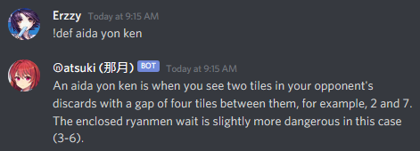
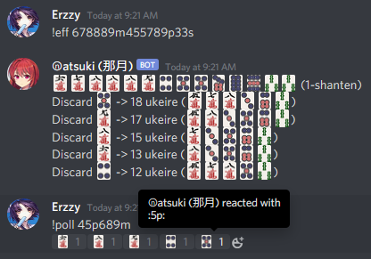
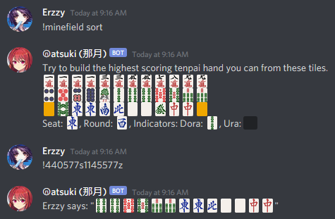
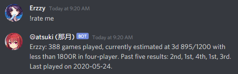
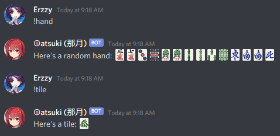

# Adding The Bot To A Server

To add Natsuki to your server, simply click on [this link](https://discordapp.com/api/oauth2/authorize?client_id=629290905723076609&permissions=330816&scope=bot). You can also find her on [top.gg](https://top.gg/bot/629290905723076609).

For permissions, she needs `Use External Emoji` for the tile emoji, and `Add Reactions` for polls and her name.

# Commands
The images are from when she used text commands. With Discord moving away from them, everything is slash commands now.

* `/define <word>` - Natsuki knows the definitions of many Mahjong words and can recall them with this command. She also has a built-in dictionary for a large number of English words as an added bonus. If you don't specify a word, she'll pick a random Mahjong term that she knows. For a list of all the terms, check the `commands/define.js` file.
* `/explain <topic>` - Natsuki has some longer explanations for common topics in Mahjong. They're a bit simplified, but good starting points if new players are asking about them. You can see a list when you try to call the command.

* `/link <site>` - Natsuki has a number of commonly referenced pages related to Mahjong that she can recall with this command. If you don't specify a site, she'll give you a random one. For a list of all the sites, call `/link list` or check the `commands/link.js` file.
* `/efficiency <hand>` - With this command, Natsuki will analyze the ukeire of each discard in a hand and output them similar to tenhou.net/2/. If the hand only has 13 tiles (or 13 minus a multiple of 3) she'll just tell you the ukeire. The hand format is the same as in /2/.

* `/minefield` - Minefield Mahjong is a 1v1 variant where each player gets 34 tiles and has to create a tenpai hand with them. Natsuki will generate 34 tiles with this command, arranged in three rows, as a fun activity.
* `/convert <message>` - Natsuki will parrot the message, swapping any hand prefixed with ! with emoji. For example, "My favourite tile is the !4z, but my favourite set is !234s."

* `/rate <player>` - Natsuki will check Nodocchi and tell you how many games that player has played on Tenhou, and what their R is at. If they haven't played in Tokujou, she'll say they have less than 1800R. If they have >1800R in sanma, she'll point that out, too, just to shame them. She'll also tell you when the last time they played was.

* `/randomhand` - Natsuki will simply generate a random hand of 14 tiles. Alias: `!hand`
* `/randomtile` - Natsuki will pick a random tile.

* `/dice` - Natsuki will roll 2d6, and tell you which player the wall is broken in front of.
* `/translate <text>` - Natsuki will replace most Japanese mahjong terms in the given text with English equivalents.
* `/score <han> <fu> <dealer> <aotenjou>` - Natsuki will convert the han and fu to a score with any of the modifiers. Dealer to change it to a dealer score, aotenjou to remove the limiting hands.